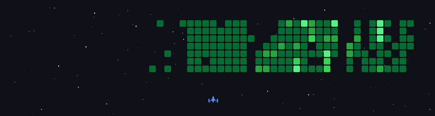
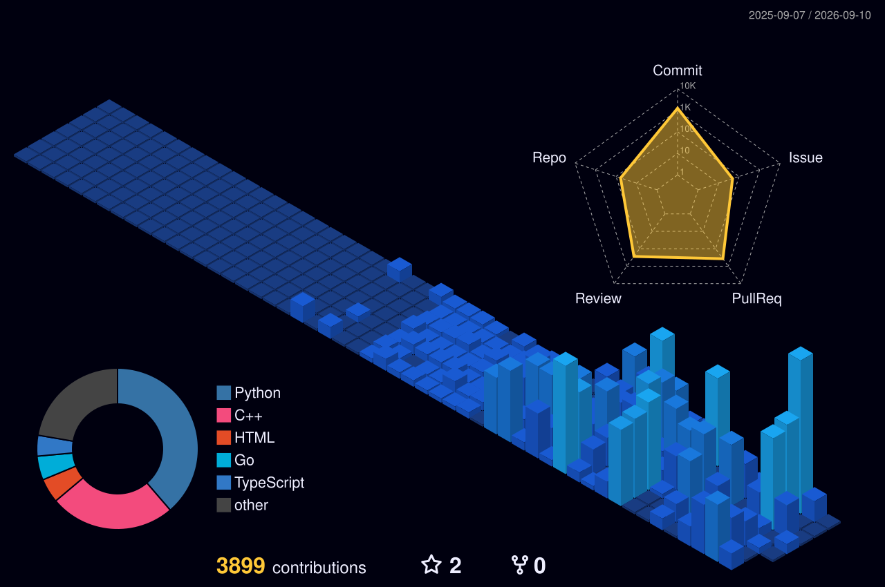

  

<h1 align="center">
  Hi there, I'm Anton
  
</h1>

  

  
  
  
  
  

---

## 🧑‍💻 About Me

- 🎓 17 y.o. developer · **Minsk, Belarus** · coding since age 14
- 🏆 Competitive robotics — **FIRA** & **Robofinist** championships · OpenCV + ESP32
- 🤖 Builds **Telegram bots** (aiogram / Telethon), **embedded systems** (ESP32 / Arduino), **Minecraft plugins** (Java)
- 🖥️ Runs own **Linux VPS** — Minecraft server · Nextcloud · Docker stack · self-hosted services
- 🌐 [antonpetnitsky.com](https://antonpetnitsky.com) · Open to internships & remote collaboration

---

## 💻 Tech Stack

  
  
  
  
  
  
  
  
  
  
  
  
  
  
  
  
  
  
  

---

## 📊 GitHub Stats

  
  

  

  

<picture>
  <source media="(prefers-color-scheme: dark)" srcset="https://raw.githubusercontent.com/Mukller/Mukller/output/github-contribution-grid-snake-Dark.svg">
  <source media="(prefers-color-scheme: light)" srcset="https://raw.githubusercontent.com/Mukller/Mukller/output/github-contribution-grid-snake-Light.svg">
  
</picture>

  

  

---

## 📫 Contact

  
  
  
  

---

  <i>&#11088; From <a href="https://github.com/Mukller">Anton Petnitsky</a> &middot; Thanks for visiting!</i>

  

